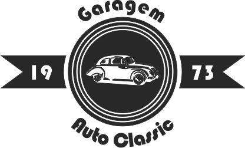

<h1 align="center">
 
  
 
 
Garagem 1973
</h1>

Landing page da Gragem 1973 para o desafio do Hiring Coders

  

  <a href="#o-projeto">O Projeto</a>&nbsp;&nbsp;&nbsp;|&nbsp;&nbsp;&nbsp;
  <a href="#recursos">Recursos</a>&nbsp;&nbsp;&nbsp;|&nbsp;&nbsp;&nbsp;
  <a href="#licença">Licença</a>

[//]: # (Add your gifs/images here:)

  

## O Projeto
Durante o Hiring Coders foi proposto o desafio de se desenvolver uma Landing page de um ecommerce utilizando os conhecimentos já adquiridos até aquele momento no curso. O resultado foi esse aqui.
  
A página pode ser visualizada [aqui :blue_car:](https://andreLTMoraes.github.io/garagem1973)

## Recursos
[//]: # (Add the features of your project here:)

- ⚛️ **React** — Biblioteca JavaScript de código aberto com foco em criar interfaces de usuário em páginas web.
- :nail_care: **Styled Components** — Utiliza Template Literals com tags e o poder do CSS para estilizar componentes.
- :octocat: **GitHub Pages** — Sites para você e seus projetos, hospedados diretamente de seu repositório GitHub.

## Licença

This project is licensed under the MIT License - see the [LICENSE](https://opensource.org/licenses/MIT) page for details.